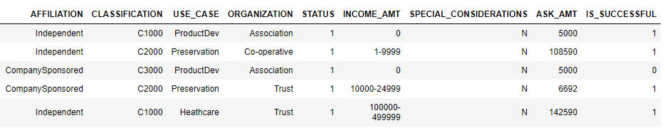
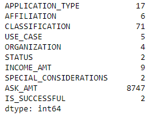
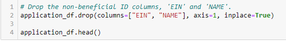
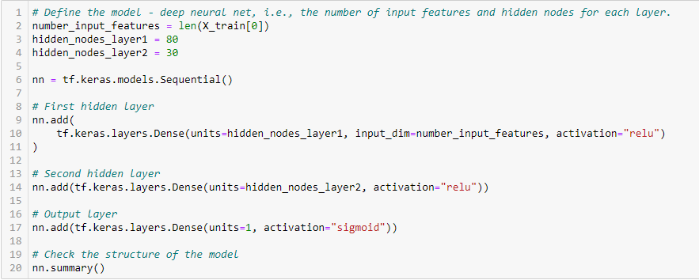
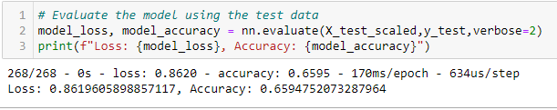
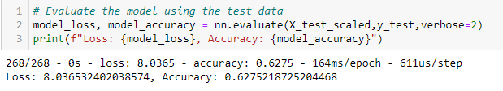
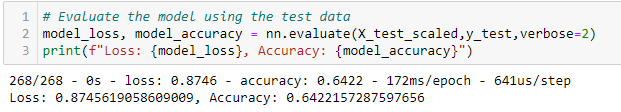
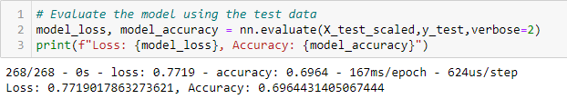

# Neural_Network_Charity_Analysis

## Overview of the Analysis
The purpose of this analysis was to create a binary classifier that is able to predict whether applicants will be successful if funded by Alphabet Soup.

## Results

### Data Preprocessing

* What variable(s) are considered the target(s) for your model?
        The target for the model is the "IS_SUCCESSFUL" variable.
        
* What variable(s) are considered to be the features for your model?
        The following are considered to be the features variables:
        

* What variable(s) are neither targets nor features, and should be removed from the input data?
        The "EIN" and the "Name" variables need to be removed from the input data.
        

### Compling, Traning, and Evaluating the Model

* How many neurons, layers, and activation functions did you select for your neural network model, and why?
        

        The neurons were selected based on the number of input features in the dataset (9 in this case).  The layers were chosen as a best guess to start the process of trial and error and get a baseline to continue working through to optimize the model accuracy.

* Were you able to achieve the target model performance?  No
        

* What steps did you take to try and increase model performance?
1. Removed the "AMT" variable:
        

2. Increased nodes in the hidden layers:
        

3. Decreased nodes in the hidden layers:
        

## Summary

Ultimately, this deep learning model failed to reach our target of 75%.  The initial trial resulted in an accuracy of 65.95%. Through additional trial and error (specifically, decreasing the nodes), the accuracy increased to 69.64%.

I would reccommend to continue with trial and error by further looking into the variables that could potentially be removed from the data set.  Also, with our third attempt of decreasing the nodes, we saw an increase in accuracy.  So, I would recommend continuing to manipulate the nodes and/or increase the hidden layers to see if we get closer to our goal of 75% accuracy.